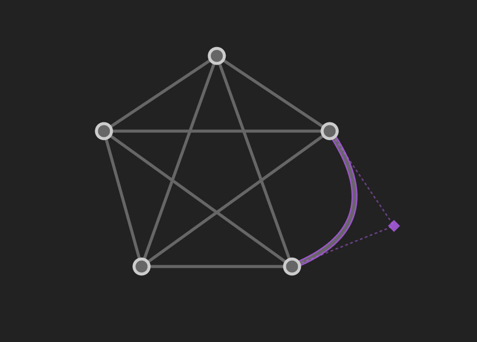

# Vertedge

A [client-side web application](https://xarkenz.github.io/vertedge/) for experimenting with and visually demonstrating graph theory through an intuitive interface.

I built this in my spare time a while back, so I hope you'll understand that this is still a bit rough around the *edges* (pun intended).

## Tools and Menus

### Select (<kbd>V</kbd>)

This is the default tool. Click on vertices and edges to select them, and drag them to move them around. If you drag an edge, it will become a curve which you can adjust to your needs. To select multiple elements at once, drag from empty space to select a region or hold <kbd>Shift</kbd> when clicking on elements.

### Move (<kbd>M</kbd>)

This tool allows you to move the entire view by dragging. This can be especially helpful if you find yourself running out of room on the screen. You can also right-click and drag in any mode to move the view.

### Draw (<kbd>D</kbd>)

This tool allows you to create new edges and vertices by clicking and dragging. You can split edges by clicking on them. While drawing an edge, holding <kbd>Ctrl</kbd>/<kbd>⌘Cmd</kbd> creates a loop which connects a vertex to itself. Press <kbd>Esc</kbd> to cancel drawing an edge.

### Erase (<kbd>X</kbd>)

Use this tool to remove vertices and edges from the graph. You can also use <kbd>Delete</kbd> or <kbd>Backspace</kbd> to remove the current selection in any mode. If a vertex is removed, all connecting edges are removed.

### Style (<kbd>S</kbd>)

This tool allows you to modify the appearance of selected elements through a menu.

### Grid (<kbd>G</kbd>)

This menu allows you to enable/disable and modify settings for a grid if you want to make your graph more orderly.

### Capture

This tool allows you to download a PNG image of a region of your graph with a transparent background for convenience. If any graph elements are currently selected and the "Capture selection only" option is used, unselected elements will not be included in the capture. The resolution of a capture is currently fixed at 1 unit = 1 pixel, but this may change in the future.

### Load (<kbd>Ctrl</kbd>/<kbd>⌘Cmd</kbd> <kbd>O</kbd>)

This menu allows you to load a graph either from a file on your device or from the list of examples.

### Save (<kbd>Ctrl</kbd>/<kbd>⌘Cmd</kbd> <kbd>S</kbd>)

This menu allows you to save the current graph to a file on your device. Unfortunately, cloud saving is not supported. Maybe someday.

### View Data

This menu contains the raw JSON data for the graph. You can mess around with it if you like, and the graph will update dynamically. Usually, you won't need to use this

### Help (<kbd>H</kbd>)

This menu contains information about how to use Vertedge, all of which is also here.

## Controls

### Zoom In (<kbd>+</kbd>)

Zoom in to the graph by a fixed amount.

### Zoom Out (<kbd>-</kbd>)

Zoom out of the graph by a fixed amount.

### Zoom Default (<kbd>0</kbd>)

Zoom to the default zoom level.

### Center View (<kbd>.</kbd>)

Move the view to the center of the graph.

### Select All (<kbd>Ctrl</kbd>/<kbd>⌘Cmd</kbd> <kbd>A</kbd>)

Select all elements in the graph.

### Deselect All (<kbd>Ctrl</kbd>/<kbd>⌘Cmd</kbd> <kbd>Shift</kbd> <kbd>A</kbd> or <kbd>Esc</kbd>)

Deselect all currently selected graph elements.

### Erase Selected (<kbd>Delete</kbd> or <kbd>Backspace</kbd>)

Remove all currently selected elements from the graph. If a vertex is removed, all connecting edges are removed.
